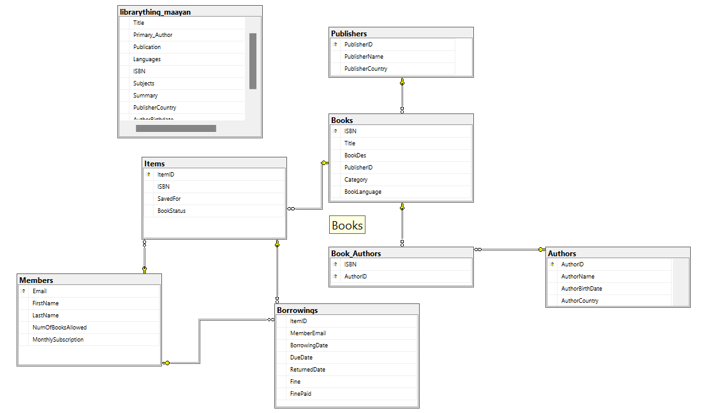

# Library Database

This project aims to demonstrate the process of creating a database using SQL and populating it with sample data. The project was completed as part of a data analyst course to gain practical experience in database management and data manipulation.

## Usage Instructions
to recreate and populate the library database:

Database Setup:

- Ensure you have a SQL database server installed (e.g., MySQL, PostgreSQL).
- Execute the CreateDatabase.sql script to create the database schema.

Import Flat File Using SSMS Import Wizard:

- Place your CSV files (librarything_maayan.csv) in a directory accessible to your database server.
- Right-click on the Database: Right-click on your newly created database in SSMS Object Explorer.
- Tasks > Import Flat File: Select Tasks -> Import Flat File....
Flat File Source:
- Choose your flat file .
- Specify delimiter and column mappings.
- Run: Execute the import operation.

Populating with Sample Data:

- Execute the PopulateDatabase.sql script to populate the database with initial sample data.

## ERD

